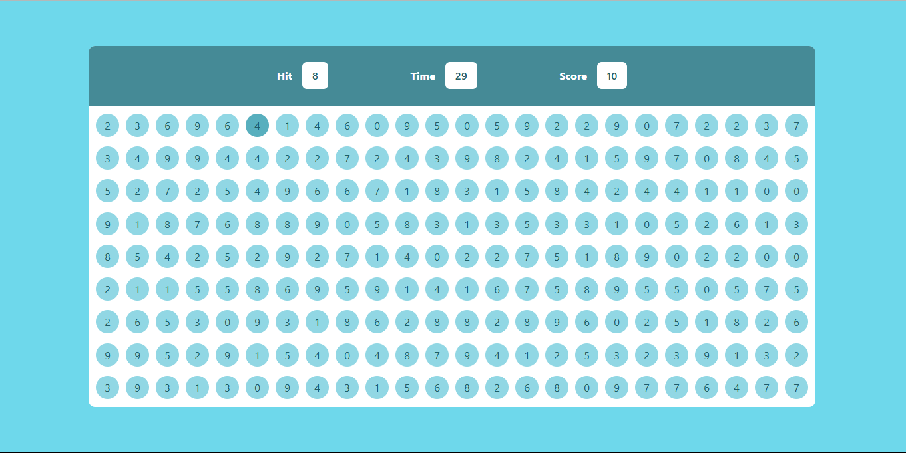

# 🎯 Bubble Game
---
A fun and interactive number-clicking game built using **HTML**, **CSS**, and **JavaScript**. The goal is simple — hit the bubble that matches the number shown at the top before the time runs out!

---
## 🕹️ How to Play

- A random number will be displayed in the "Hit" box.
- You have 60 seconds to click on bubbles with the **same number** as shown.
- Each correct hit gives you **+10 points**.
- When the timer runs out, the game is over and your final score is displayed.
---
## 💡 Features

- Dynamic bubble generation
- Countdown timer
- Real-time scoring
- Clean and responsive design
- Interactive hover effects

---

## 📂 Project Structure
```
📁 Bubble-Game/
├── index.html        // Main HTML structure
├── style.css         // Styling of the game UI
└── script.js         // Game logic and interactivity
```

---


## 📸 Preview

[](https://youtu.be/2Q-mxQ09imY)


---

## 🚀 Technologies Used

- HTML5
- CSS3
- JavaScript (ES6)

---

## 📌 Future Improvements

- Add difficulty levels
- Sound effects and animations
- High score tracking
- Mobile optimization

---

## 🤝 Contributing

Pull requests are welcome! If you have suggestions or improvements, feel free to fork the repo and submit a PR.

---

## 📜 License

This project is open source.


